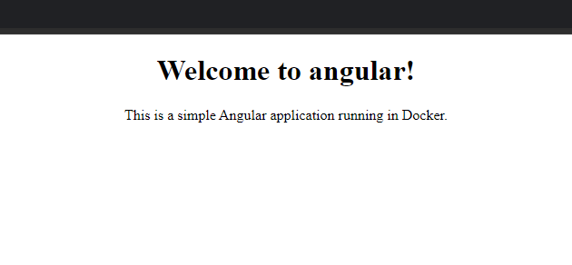

# Angular Application with Docker Compose

This project demonstrates how to set up a simple Angular application using Docker and Docker Compose. The application is served inside a Docker container, making it easy to run in any environment.

## Project Overview

The application is a basic Angular project that runs inside a Docker container. Docker Compose is used to define and manage the service, making it straightforward to build and deploy the project with just a few commands.

### Key Technologies

- **Angular CLI** version 13
- **Node.js** version 17 (slim version based on Debian Bullseye)
- **Docker** for containerization
- **Docker Compose** for service orchestration

## Prerequisites

Before running this project, ensure that you have the following installed:

- [Docker](https://docs.docker.com/get-docker/)
- [Docker Compose](https://docs.docker.com/compose/install/)

## Setup Instructions

### 1. Clone the Repository

```bash
git clone <your-repo-url>
cd <repo-directory>
```

### 2. Build and Run the Application

Use Docker Compose to build the Angular application and start the container.

```bash
docker-compose up --build
```

This will:

- Build the Docker image as per the `Dockerfile`.
- Start the application and expose it on port `4200`.

### 3. Access the Application

Once the container is running, open your browser and navigate to:

```
http://localhost:4200
```

You should see the following message displayed:

> Welcome to Angular! This is a simple Angular application running in Docker.

(The page will look like the image below.)



### Dockerfile Explanation

```dockerfile
# syntax=docker/dockerfile:1.4

FROM --platform=$BUILDPLATFORM node:17.0.1-bullseye-slim as builder

RUN mkdir /project
WORKDIR /project

# Install Angular CLI globally
RUN npm install -g @angular/cli@13

# Copy package files and install dependencies
COPY package.json package-lock.json ./
RUN npm ci

# Copy the rest of the project files
COPY . .

# Start the Angular development server
CMD ["ng", "serve", "--host", "0.0.0.0"]
```

- **Base image**: Uses a slim version of Node.js 17 for efficient builds.
- **Angular CLI**: Installs Angular CLI globally within the container.
- **Project setup**: Copies the `package.json` and `package-lock.json`, installs dependencies, and serves the application on `0.0.0.0` so it's accessible outside the container.

### Docker Compose Configuration

```yaml
version: '3'
services:
  web:
    build:
      context: angular
      dockerfile: Dockerfile
      target: builder
    container_name: angular-app
    ports:
      - "4200:4200"
    volumes:
      - ./angular:/project
      - /project/node_modules
```

- **Service definition**: The `web` service defines the Angular application.
- **Build configuration**: Builds the image from the `Dockerfile`.
- **Ports**: Exposes the container's port `4200` to the host machine.
- **Volumes**: Mounts the project directory and `node_modules` for easy development without rebuilding the image every time you change the source code.
