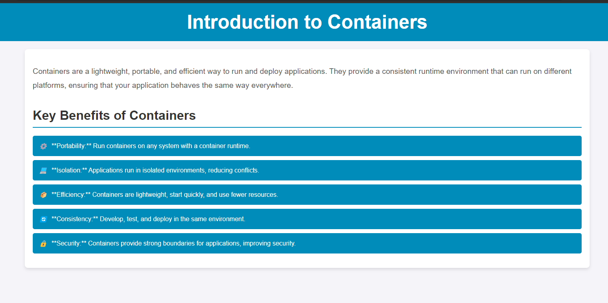

# PHP Application with Docker Compose

This project demonstrates how to set up a PHP application with an Apache server using Docker and Docker Compose. The application is served inside a Docker container, making it easy to run in any environment.

## Project Overview

The application is a simple PHP project that runs within a Docker container, with Apache serving the content. Docker Compose is used to define and manage the service, simplifying the process of building and running the application.

### Key Technologies

- **PHP** version 8.3.12
- **Apache** web server
- **Docker** for containerization
- **Docker Compose** for service orchestration

## Prerequisites

Before running this project, make sure you have the following installed:

- [Docker](https://docs.docker.com/get-docker/)
- [Docker Compose](https://docs.docker.com/compose/install/)

## Setup Instructions

### 1. Clone the Repository

```bash
git clone <your-repo-url>
cd <repo-directory>
```

### 2. Build and Run the Application

Use Docker Compose to build the PHP application and start the container.

```bash
docker-compose up --build
```

This will:

- Build the Docker image as defined in the `Dockerfile`.
- Start the application and expose it on port `80`.

### 3. Access the Application

Once the container is running, open your browser and navigate to:

```
http://localhost
```

You should see your PHP application served by Apache.

(The page will look like the image below.)



### Dockerfile Explanation

```dockerfile
FROM --platform=$BUILDPLATFORM php:8.3.12-apache as builder

CMD ["apache2-foreground"]
```

- **Base image**: Uses the official PHP 8.3.12 image with Apache.
- **Apache Server**: The container runs Apache with the `apache2-foreground` command, which launches the Apache HTTP server and keeps it in the foreground for the container to manage.

### Docker Compose Configuration

```yaml
services:
  web:
    build:
      context: app
      target: builder
    container_name: php-app
    ports:
      - '80:80'
    volumes:
      - ./app:/var/www/html/
```

- **Service definition**: The `web` service defines the PHP application.
- **Build configuration**: Builds the image from the `Dockerfile` located in the `app` directory.
- **Ports**: Exposes port `80` in the container to port `80` on the host machine.
- **Volumes**: Mounts the local `./app` directory to the container's `/var/www/html/` directory, making it easier to develop and test without rebuilding the image each time you make changes to the PHP files.

