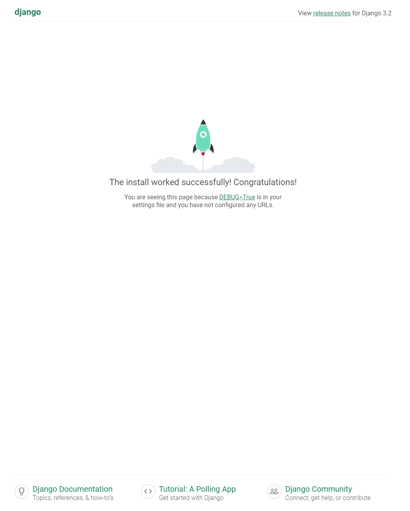

### Django Application with Docker Compose

This project demonstrates how to set up a Django application using Docker and Docker Compose. The application runs inside a Docker container, simplifying deployment in any environment.

## Project Overview

The application is a Django project that runs within a Docker container, with `docker-compose` used to define and manage the service. This setup handles the application server and database using Docker, making it portable and easy to replicate across environments.

### Key Technologies
- **Python 3.7 (Alpine)**: Lightweight Python base image for Django.
- **Django**: Web framework used in this project.
- **Docker**: For containerization of the Django application.
- **Docker Compose**: For service orchestration and defining multi-container applications.

## Prerequisites

Before running this project, make sure you have the following installed:

- Docker
- Docker Compose

## Setup Instructions

### 1. Clone the Repository
```bash
git clone <your-repo-url>
cd <repo-directory>
```

### 2. Build and Run the Application
Use Docker Compose to build the Django application and start the container:
```bash
docker-compose up --build
```

This will:
- Build the Docker image based on the `Dockerfile`.
- Start the Django application and expose it on the configured port.

### 3. Access the Application
Once the container is running, open your browser and navigate to:

```bash
http://localhost:<configured-port>
```
Replace `<configured-port>` with the value of the environment variable `WEB_PORT` in your `.env` file (if applicable) or the default port (8000).

You should see the Django application homepage.



## Dockerfile Explanation

### Base Image
The base image used in the Dockerfile is `python:3.7-alpine` for a lightweight and efficient Python environment. The `builder` stage installs all required dependencies and configures the application.

```dockerfile
FROM --platform=$BUILDPLATFORM python:3.7-alpine AS builder
RUN apk add --no-cache shadow
WORKDIR /app
COPY requirements.txt /app
RUN pip3 install -r requirements.txt --no-cache-dir
RUN apk add --no-cache curl
COPY . /app
RUN mkdir -p /app/logs && touch /app/db.sqlite3
ENTRYPOINT ["python3"]
CMD ["manage.py", "runserver", "0.0.0.0:8000"]
```

- **Python 3.7 Alpine**: Lightweight base image.
- **Pip Installation**: Installs all Python dependencies from `requirements.txt`.
- **Work Directory**: Sets `/app` as the working directory.
- **SQLite**: Creates the SQLite database file if it doesn't exist.
- **Entrypoint & CMD**: Specifies Django's runserver as the default command.

## Docker Compose Configuration

```yaml
services:
  web:
    build:
      context: app
      target: builder
    container_name: php-app
    ports:
      - "${WEB_PORT}:8000"
    healthcheck:
      test: ["CMD", "curl", "-f", "http://localhost:8000"]
      interval: 30s
      timeout: 10s
      retries: 5
    deploy:
      resources:
        limits:
          cpus: "0.50"
          memory: "512M"
    networks:
      - django_network
    security_opt:
      - no-new-privileges:true
    read_only: true
    volumes:
      - ./logs:/app/logs
      - ./data/db.sqlite3:/app/db.sqlite3
```

### Service Definition
- **`web` service**: Defines the Django web application.
- **Build context**: Builds the image from the `Dockerfile` located in the `app` directory.
- **Ports**: Exposes port `8000` on the container, mapped to the host's port defined by the `WEB_PORT` environment variable.
- **Healthcheck**: Regularly checks if the Django application is responding on port 8000.
- **Resource Limits**: CPU and memory limits ensure that the container doesn't overuse system resources.
- **Security**: Adds security options, such as `no-new-privileges` for additional protection.

### Volumes
- **Log Directory**: The local `logs` directory is mapped to `/app/logs` in the container.
- **Database**: The SQLite database file `db.sqlite3` is persisted locally under `data/db.sqlite3`.

### Networks
A custom Docker network `django_network` is defined to allow services to communicate.

## Environment Variables

You can define custom environment variables such as the `WEB_PORT` in a `.env` file. The default port is set to `8000`.

## Healthcheck

The `healthcheck` ensures that the service is running correctly by sending a request to `http://localhost:8000`. If the healthcheck fails after the configured retries, Docker marks the container as unhealthy.

## Resource Limits

To ensure stability, the container limits are set:
- **CPUs**: Limited to 50% of the host's CPU.
- **Memory**: Capped at 512MB of RAM.
